# NYC Housing Intelligence Platform

A production-oriented housing intelligence application that turns fragmented New York City public data into reliable, building-level information that renters can actually use.

New York City already publishes large amounts of housing data: complaints, housing-code violations, permit activity, property and lot information, and other records that describe what has happened at a building over time. The problem is not that the data does not exist. The problem is that it is distributed across separate datasets, represented with agency-specific schemas and identifiers, and difficult to connect to the building a renter is considering.

This project is designed to bridge that gap.

A user should be able to enter an address and get a coherent building profile containing current and historical problems, complaint and violation trends, permit activity, building comparisons, explainable risk/quality indicators, and an AI assistant that can answer natural-language questions using the same deterministic facts shown by the rest of the product.

The project is designed as a **production-minded modular monolith**. The architecture favors correctness, provenance, explicit workload boundaries, recoverable ingestion, and explainable AI.

---

## Table of Contents

- [Problem](#problem)
- [Goals](#goals)
- [Core Engineering Principles](#core-engineering-principles)
- [High-Level Architecture](#high-level-architecture)
- [Why a Modular Monolith](#why-a-modular-monolith)
- [Data Sources and Ingestion](#data-sources-and-ingestion)
  - [Large Snapshot Ingestion: MapPLUTO](#large-snapshot-ingestion-mappluto)
  - [Incremental Ingestion: HPD and Similar Feeds](#incremental-ingestion-hpd-and-similar-feeds)
  - [Ingestion Metadata and Recovery](#ingestion-metadata-and-recovery)
- [Building Identity Resolution](#building-identity-resolution)
- [Historical State and Data Quality](#historical-state-and-data-quality)
- [Derived Metrics, Comparisons, and Indicators](#derived-metrics-comparisons-and-indicators)
- [Authoritative Data and Domain Logic](#authoritative-data-and-domain-logic)
- [Normal Request Flows](#normal-request-flows)
- [AI Assistant Architecture](#ai-assistant-architecture)
  - [Synchronous vs Asynchronous AI Execution](#synchronous-vs-asynchronous-ai-execution)
  - [Tool Calling](#tool-calling)
  - [Structured Facts vs Official Guidance](#structured-facts-vs-official-guidance)
  - [AI Evaluation](#ai-evaluation)
- [Search and Retrieval Strategy](#search-and-retrieval-strategy)
- [Scale Assumptions](#scale-assumptions)
- [Failure Modes and Reliability](#failure-modes-and-reliability)
- [Technology Choices](#technology-choices)
- [What This Project Deliberately Does Not Use](#what-this-project-deliberately-does-not-use)
- [Expected Repository Structure](#expected-repository-structure)
- [Architecture Evolution Triggers](#architecture-evolution-triggers)
- [Current Design Constraints](#current-design-constraints)

---

## Problem

A renter evaluating an apartment may want to know:

- Does this building repeatedly lose heat during winter?
- Are there serious housing-code violations currently open?
- Have the same problems appeared year after year?
- Are complaint levels improving or worsening?
- Is this building unusually problematic compared with similar buildings nearby?
- Are recent problems isolated incidents or part of a persistent pattern?
- What does a particular violation class mean?
- What obligations does a landlord have under official NYC housing rules?

The underlying evidence may already exist in NYC public datasets, but using it directly is difficult because the data is:

- split across multiple sources,
- large and periodically refreshed,
- represented with different schemas,
- keyed by identifiers unfamiliar to ordinary users,
- inconsistent in address representation,
- affected by corrections, duplicates, missing values, and historical changes,
- not organized around the question a renter is actually asking: **"What should I know about this building?"**

The central technical problem is therefore:

> **Transform messy, fragmented public housing data into trustworthy building-level facts, then turn those facts into understandable analysis without losing provenance, uncertainty, or consistency.**

---

## Goals

The platform is designed to support the following product capabilities:

- address-based building lookup,
- unified building profiles,
- current and historical housing violations,
- complaint history and trends,
- permit activity,
- recurring-problem detection,
- severity and recency summaries,
- neighborhood or peer-building comparisons,
- explainable risk/quality indicators,
- natural-language building analysis,
- retrieval of relevant official NYC housing guidance,
- evidence-backed AI answers with citations,
- explicit handling of incomplete or uncertain data.

The project is equally concerned with *how* those capabilities are built. The architecture should remain:

- understandable by one developer,
- realistic for production,
- easy to test,
- easy to explain,
- recoverable when ingestion fails,
- consistent across web and AI surfaces,
- scalable enough for the expected workload,
- free of infrastructure that does not solve an observed problem.

---

## Core Engineering Principles

### 1. Deterministic facts have one definition

The web application and the AI assistant must not calculate the same building fact independently.

If the building profile says there are 14 open violations, the AI assistant must not independently derive 17.

Structured facts and deterministic interpretations should come from the same domain capabilities.

```text
PostgreSQL/PostGIS
        ↓
shared domain logic
   ↙           ↘
Web API      AI tools
```

### 2. The LLM does not own factual truth

The LLM is responsible for:

- understanding user intent,
- deciding which approved capabilities are needed,
- combining evidence,
- explaining results clearly.

It is **not** responsible for:

- counting database rows,
- recomputing violation totals,
- inventing risk metrics,
- writing arbitrary SQL against production data,
- substituting model knowledge for building-specific evidence.

### 3. External data is not trusted merely because it is public

All incoming NYC data is treated as externally controlled data that may contain:

- malformed records,
- duplicates,
- corrections,
- missing identifiers,
- inconsistent dates,
- schema changes,
- incomplete periods,
- unexpected values.

Data should cross an explicit validation boundary before becoming authoritative application data.

### 4. Slow or bursty work should not endanger normal product traffic

Address search, building profiles, and comparisons should remain available even when:

- a large ingestion run is active,
- AI traffic spikes,
- the model provider becomes slow,
- queued AI work begins to accumulate.

### 5. Add infrastructure only when a concrete problem justifies it

The architecture intentionally starts with the simplest mechanism that correctly solves the current workload.

New infrastructure should be introduced because a measurable limitation appeared, not because the technology is impressive on a diagram.

---

# High-Level Architecture

The system uses a **production-oriented modular monolith with separate runtime workloads where their operational behavior differs**.

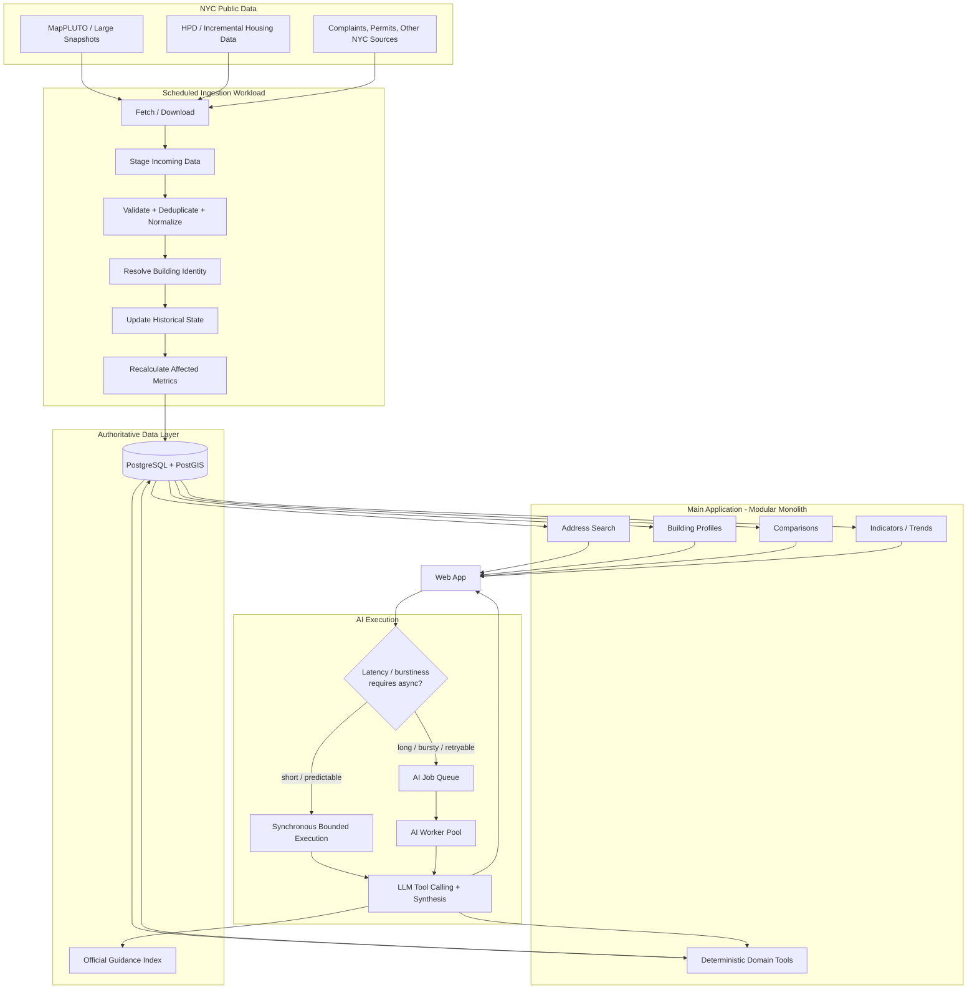

The most important architectural boundary is:

> **Normal product functionality stays synchronous and deterministic. AI work always has bounded, isolated execution; workloads whose latency or burstiness justifies it are moved behind an asynchronous queue and worker pool.**

---

# Why a Modular Monolith

The housing domain is tightly connected around a shared concept of building identity and historical state.

A building profile may need information from:

- building/property metadata,
- violations,
- complaints,
- permits,
- neighborhood geography,
- historical metrics,
- comparison populations,
- derived indicators.

Splitting each concern into a separate service would create network boundaries without solving a current ownership or scaling problem.

The application therefore remains one logical backend with strong internal modules such as:

```text
application/
├── buildings/
├── address_search/
├── violations/
├── complaints/
├── permits/
├── comparisons/
├── indicators/
├── assistant/
│   └── tools/
└── shared/
    └── domain/
```

The exact package layout may evolve, but the boundary is architectural: modules should communicate through explicit application/domain capabilities rather than reaching arbitrarily into one another's persistence logic.

### Why not microservices?

A service-per-domain design would add:

- network calls,
- duplicated contracts,
- multiple deployments,
- cross-service consistency problems,
- more complex debugging,
- more failure modes,
- more infrastructure for one developer to operate.

Those costs are not currently justified by the expected traffic or team size.

---

# Data Sources and Ingestion

The platform consumes public datasets that update **periodically**, not as a continuous event stream.

That makes scheduled ingestion the natural operational model.

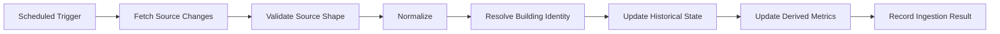

The platform deliberately distinguishes between **large snapshot refreshes** and **small incremental updates**, because they have different operational characteristics.

---

## Large Snapshot Ingestion: MapPLUTO

MapPLUTO-style data arrives as a comparatively large snapshot. The intended ingestion pattern is:

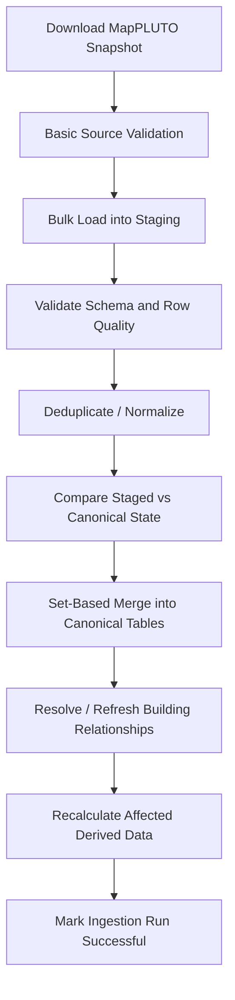

A staging table is useful here because it creates a clean boundary between an externally controlled snapshot and trusted application state.

It also makes it possible to answer operational questions before publication:

- Did the source schema change?
- Did the row count change unexpectedly?
- Are there duplicate records?
- Which records are new?
- Which records changed?
- Which records disappeared?
- Did normalization reject any values?
- Can the run be retried safely?

For a dataset on the order of hundreds of thousands or around a million rows, a normal Postgres bulk-load + staging + merge workflow is sufficient. The volume alone does not justify Spark, Kafka, or a distributed data platform.

---

## Incremental Ingestion: HPD and Similar Feeds

Incremental housing updates are smaller than a full MapPLUTO refresh, but they are still externally controlled data.

The platform therefore **does not write HPD deltas directly into canonical tables**.

Instead, each ingestion run uses a lightweight per-run staging boundary:

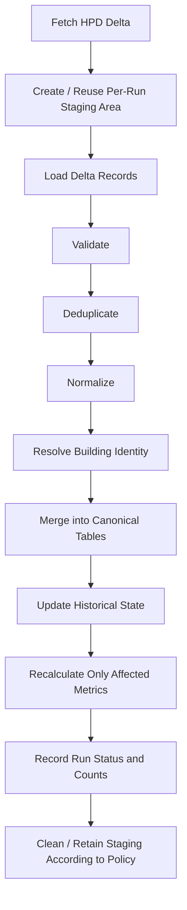

This is intentionally lighter than staging a complete source snapshot, but it preserves the important production properties of a staging boundary:

- source problems can be inspected before canonical data changes,
- duplicate delta records can be detected,
- validation failures are visible,
- partial failures are easier to recover from,
- merge logic can remain set-based and idempotent,
- ingestion runs can be audited independently.

A direct upsert can be appropriate for small and highly trustworthy incremental feeds in other systems. For this platform, the extra safety of a lightweight per-run staging step is worth the small amount of additional complexity.

---

## Ingestion Metadata and Recovery

Each ingestion run should record enough metadata to answer what happened without reconstructing the event from application logs.

Useful fields include:

```text
source_dataset
started_at
finished_at
source_version_or_timestamp
rows_received
rows_valid
rows_rejected
rows_inserted
rows_updated
status
error_summary
```

This metadata supports:

- freshness reporting,
- operational debugging,
- partial-failure detection,
- retry decisions,
- data-quality monitoring,
- comparison of one source refresh with another.

The system should be able to distinguish:

```text
"This building has zero reported events"
```

from:

```text
"The relevant source data is missing, incomplete, stale, or not yet successfully ingested"
```

That distinction is essential for trustworthy renter-facing conclusions.

---

# Building Identity Resolution

Building identity is one of the hardest problems in the project and one of the most important to get right.

A record is useful only if it is attached to the correct physical property.

The resolver must be prepared for:

- inconsistent address formatting,
- alternate entrances,
- multiple identifiers,
- missing identifiers,
- duplicate source records,
- historical property changes,
- ambiguous user input,
- partial addresses,
- input errors.

Conceptually, source records should converge on a canonical application-level building identity.

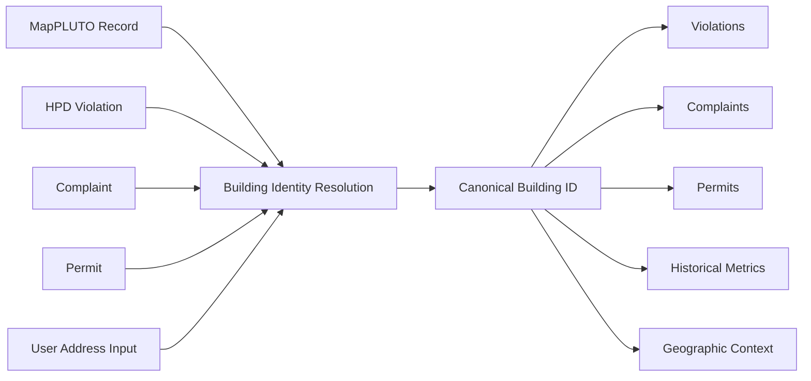

The implementation should preserve enough provenance to explain *how* a record was associated with a building, rather than hiding identity resolution inside an opaque ingestion step.

The goal is not merely address normalization. The goal is a stable building identity that can support cross-dataset joins and historical analysis.

---

# Historical State and Data Quality

The platform is not only interested in the latest source row. It needs enough historical context to distinguish:

- new problems,
- active problems,
- resolved problems,
- corrected records,
- recurring problems,
- persistent problems,
- changing patterns over time.

An ingestion **upsert or merge mechanism is not itself the historical model**.

For every source, the application must decide which source dates, status changes, and observation history are necessary to support the product's trend and recurrence features.

The project does **not** require full event sourcing by default. It does require preserving enough history to answer renter-facing questions truthfully.

### Data-quality concerns

The ingestion and domain layers must account for:

- missing values,
- malformed addresses,
- duplicate rows,
- inconsistent statuses,
- contradictory records,
- source corrections,
- incomplete time periods,
- records that arrive later than expected,
- schema changes.

Derived conclusions should carry the same caution as their underlying evidence.

---

# Derived Metrics, Comparisons, and Indicators

Raw totals are not enough to tell a renter whether a building is unusual or concerning. A large building may naturally generate more records than a small one, and an old unresolved problem is different from several minor recent records.

The domain layer is therefore responsible for deterministic, testable interpretations such as:

```text
complaint trends
violation persistence
recurring problem detection
recent severe violations
neighborhood percentiles
peer-building comparisons
risk / quality factors
```

Comparisons should make their population and time window explicit. Where relevant, calculations should account for factors such as building size, available data, and the period being compared rather than relying only on raw event counts.

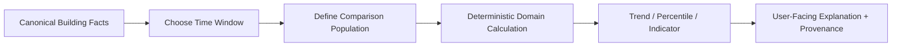

Risk or quality indicators should remain **explainable and traceable**. The platform should avoid presenting an opaque composite number as if it were objective truth when the underlying calculation cannot be justified.

The same rule applies to temporal conclusions such as "improving" or "worsening": the conclusion should come from defined metrics and time windows, not from an LLM inventing a narrative around a few records.

---

# Authoritative Data and Domain Logic

PostgreSQL/PostGIS is the authoritative structured data store for deterministic building facts.

Examples of domain capabilities include:

```text
get_building_summary(building_id)
get_open_violations(building_id)
get_complaint_trends(building_id)
compare_buildings(a, b)
get_neighborhood_benchmark(building_id)
get_risk_factors(building_id)
```

The exact function names are illustrative. The architectural rule is not.

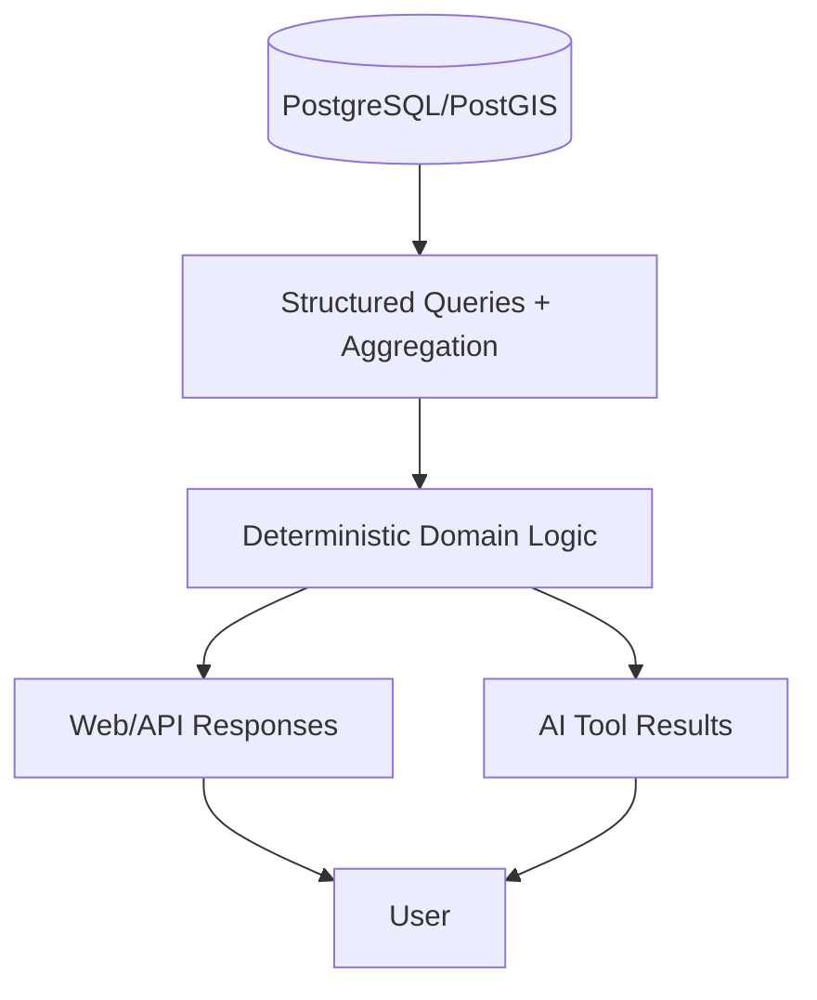

### Responsibility hierarchy

| Layer | Responsibility | Examples |
|---|---|---|
| PostgreSQL/PostGIS | Authoritative structured facts and aggregation | open violations, complaint records, permit dates |
| Backend/domain code | Deterministic interpretation | trends, recurrence, percentiles, comparison logic, risk factors |
| Retrieval | Relevant unstructured official guidance | housing rules, HPD guidance, tenant information |
| LLM | Intent understanding and synthesis | explaining what the evidence means for the user's question |

A useful rule is:

> **SQL retrieves authoritative facts. Domain code calculates deterministic meaning. Retrieval finds unstructured official knowledge. The LLM interprets intent and synthesizes evidence.**

---

# Normal Request Flows

Ordinary building-product requests remain simple and synchronous.

## Address / Building Profile

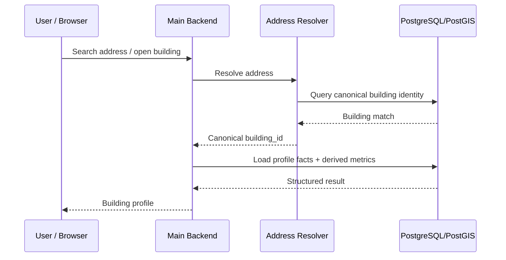

## Building Comparison

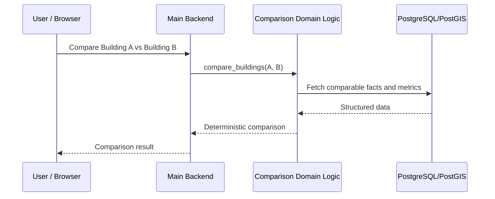

These request paths should not depend on the LLM or an AI queue.

---

# AI Assistant Architecture

The AI assistant is designed to answer natural-language housing questions without becoming a second source of truth.

Typical questions may require:

- one or more building summaries,
- serious/open violation information,
- complaint trends,
- building comparisons,
- derived indicators,
- official NYC guidance.

The model chooses which approved capabilities are needed, but the application executes those capabilities.

---

## Synchronous vs Asynchronous AI Execution

Not every AI request needs a durable queued workflow.

Short, predictable requests may execute synchronously, provided they still respect hard concurrency and execution limits.

Long-running, bursty, retryable, or expensive requests are moved behind an asynchronous queue.

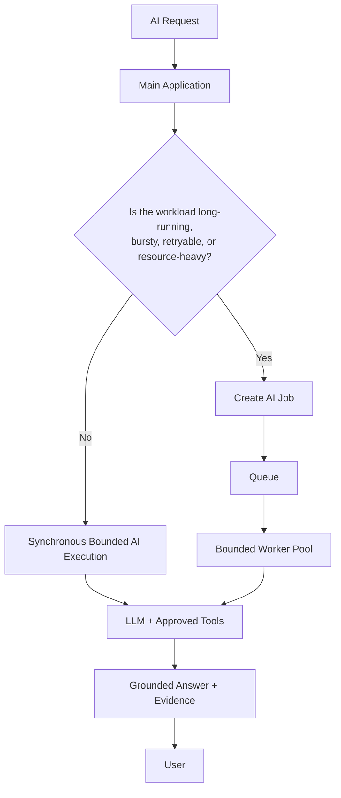

This keeps the design proportional to the workload while preserving isolation.

### Bounded execution

Whether the request is synchronous or asynchronous, AI execution should enforce safeguards such as:

```text
maximum active AI jobs
maximum provider concurrency
maximum model turns
maximum tool calls
maximum execution time
retry limits
backoff policy
```

### Why queue at all?

If the system can safely process only a bounded number of AI analyses at once, a traffic spike should increase AI latency rather than collapse the rest of the product.

```text
200 incoming AI requests
          ↓
        queue
          ↓
10 active analyses at a time
          ↓
remaining jobs wait or are rejected according to policy
```

This protects against:

- database connection exhaustion,
- model-provider rate limits,
- timeouts,
- memory pressure,
- retry storms,
- resource competition with normal building requests.

---

## Tool Calling

The LLM does **not** receive arbitrary SQL access.

### Avoid

```text
LLM
 ↓
generated SQL
 ↓
production database
```

### Prefer

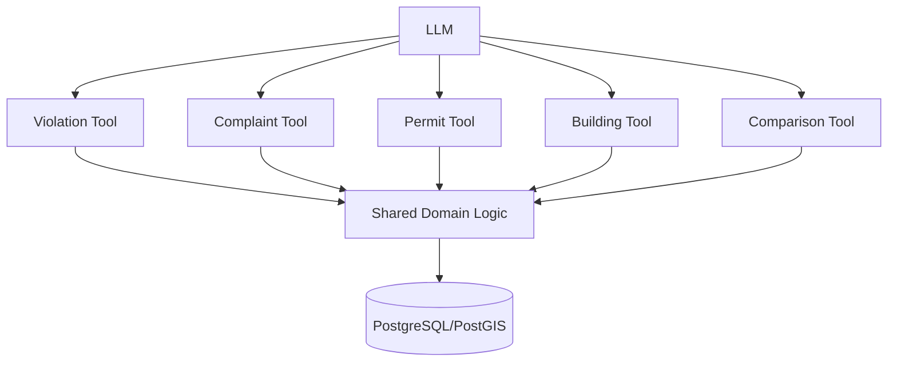

Examples of approved tool-style capabilities might include:

```text
get_building_summary(building_id)
get_violation_summary(building_id, period)
get_complaint_trends(building_id, period)
get_permit_activity(building_id, period)
compare_buildings(building_a, building_b)
search_official_guidance(query)
```

This provides:

- predictable inputs and outputs,
- safer queries,
- reusable business rules,
- easier testing,
- easier citation generation,
- better observability,
- fewer hallucinations,
- simpler AI evaluation.

---

## Structured Facts vs Official Guidance

The assistant uses two fundamentally different evidence sources.

### Structured building facts

Example:

> This building currently has seven open violations.

Source: normalized application data and deterministic domain logic.

### Official housing guidance

Example:

> What does a Class C violation mean?

Source: retrieved official NYC documentation.

These evidence types should remain separate in both retrieval and citation handling.

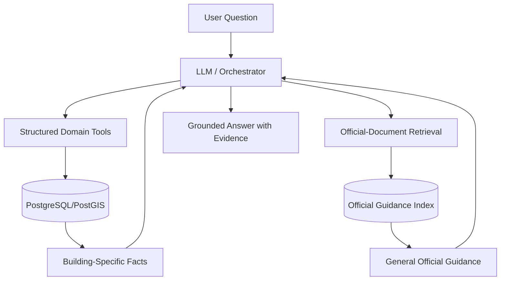

The model should not blur general guidance into a claim about a specific property, or use building-specific data as a substitute for official legal/agency guidance.

---

## AI Evaluation

AI evaluation is treated as a **testing system**, not as a production microservice.

An evaluation case can define:

```text
question
expected tools
expected evidence
expected constraints
```

The evaluation suite should measure whether the assistant:

- selected the correct tools,
- retrieved the correct evidence,
- missed required evidence,
- made unnecessary tool calls,
- cited claims correctly,
- contradicted deterministic facts,
- hallucinated unsupported information,
- handled missing data appropriately,
- produced a grounded answer.

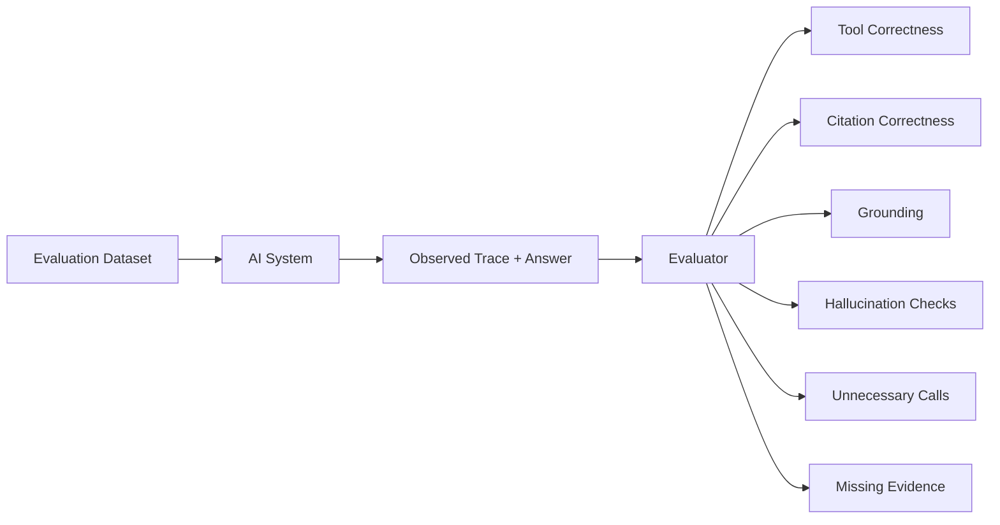

The evaluation suite can run during development, before releases, and after changes to tools, prompts, retrieval, or model providers.

---

# Search and Retrieval Strategy

The platform's dominant structured problem is relational and geospatial, so PostgreSQL/PostGIS remains the primary datastore.

Official-document retrieval should start simple.

### Phase 1: PostgreSQL full-text search

Good for explicit terminology such as:

```text
Class C violation
heat season
housing maintenance code
emergency repair
HPD
```

Advantages:

- no additional datastore,
- deterministic behavior,
- simple metadata filtering,
- straightforward debugging,
- easier operations.

### Phase 2: semantic retrieval only if evaluation justifies it

If evaluation shows lexical retrieval missing relevant paraphrases, semantic search can be added.

Example:

```text
User: "My apartment is freezing. What does my landlord have to do?"

Relevant official text: "minimum indoor temperature requirements ..."
```

If embeddings become useful, **pgvector** is the preferred first step because it keeps embeddings, metadata, filters, document text, and citation information inside PostgreSQL.

A dedicated vector database is not part of the initial architecture.

---

# Scale Assumptions

The architecture is intentionally designed for the project's expected scale rather than theoretical maximum throughput.

It is appropriate for:

- one developer,
- periodically refreshed public datasets,
- millions or tens of millions of historical rows,
- modest overall user traffic,
- considerably more ordinary building-profile traffic than AI traffic,
- bursty AI usage,
- hundreds or thousands of AI analyses per day,
- one product rather than a platform maintained by many independent teams.

The architecture already contains useful scaling boundaries if demand grows:

```text
Main API instances      → scale independently
AI workers              → scale independently
Ingestion resources     → scale independently
PostgreSQL tuning       → optimize as measured
```

The goal is not to pre-build hyperscale infrastructure. It is to avoid architectural dead ends while keeping the current system manageable.

---

# Failure Modes and Reliability

Production-minded architecture is defined as much by failure behavior as by the happy path.

## 1. AI queue saturation

If queued AI work arrives faster than the workers can process it, the queue grows.

Possible responses include:

- rate limits,
- usage quotas,
- queue-size thresholds,
- request rejection,
- additional workers.

Desired behavior:

> **AI becomes slower under load rather than taking down the entire housing product.**

---

## 2. AI workers overload PostgreSQL

Separating AI into workers does not automatically protect the database.

For example:

```text
20 workers × 8 expensive tool calls each
```

can still create unacceptable database pressure.

Mitigations include:

- bounded AI concurrency,
- efficient tool contracts,
- aggregated domain queries,
- query/index optimization,
- limited tool-call budgets,
- avoiding unrestricted exploratory SQL.

---

## 3. Model-provider rate limits or outages

The housing product should remain useful even when an LLM provider is unavailable.

AI execution should account for:

- provider rate limits,
- temporary failures,
- retries,
- exponential/backoff behavior,
- timeouts,
- graceful error responses.

Normal address search, building profiles, and deterministic comparisons should not depend on model availability.

---

## 4. Failed or partial ingestion

A failed import can leave different datasets at different freshness levels if publication boundaries are not tracked.

The system should expose concepts such as:

```text
dataset last updated
ingestion run status
source version / timestamp
data freshness
```

Staging and per-run metadata make failures inspectable and retries safer.

---

## 5. Data-quality ambiguity

A missing record does not always mean that nothing happened.

The application must avoid presenting:

```text
no data
```

as if it necessarily means:

```text
no problems
```

User-facing summaries should preserve uncertainty where source completeness is uncertain.

---

## 6. Modular monolith decay

A monolith can still become unmaintainable if internal boundaries are ignored.

Avoid arbitrary coupling between:

```text
HTTP handlers
AI orchestration
database access
data cleaning
comparison logic
indicator calculations
```

The monolith should remain modular even though it is deployed as one core application.

---

# Technology Choices

The architecture is built around workload fit rather than technology preference.

| Area | Choice | Why |
|---|---|---|
| Backend | Python + FastAPI | Fits the project's Python-heavy ingestion, AI, retrieval, evaluation, and data-processing workloads while keeping one primary language ecosystem |
| Structured data | PostgreSQL | Strong relational model, transactions, joins, aggregation, data integrity, and mature operational tooling |
| Geospatial data | PostGIS | Native fit for building geography, spatial relationships, and neighborhood-level analysis |
| Backend architecture | Modular monolith | Keeps tightly related housing capabilities together without microservice overhead |
| Ingestion | Scheduled workers/jobs | NYC source data updates periodically rather than continuously |
| Large imports | Staging + set-based merge | Safer validation, deduplication, inspection, retry, and publication for large snapshots |
| Incremental imports | Lightweight per-run staging + merge | Preserves a validation/recovery boundary without full-snapshot staging overhead |
| AI orchestration | Native model tool calling + thin application orchestration | Transparent, testable, and sufficient while the workflow remains modest |
| AI execution | Bounded synchronous execution or queued workers depending on workload | Avoids forcing every model request into job semantics while retaining backpressure for expensive/bursty work |
| Official-doc search | PostgreSQL full-text search first | Simple and explainable; already inside the primary datastore |
| Semantic retrieval | pgvector only if evaluation demonstrates the need | Adds semantic retrieval without introducing another database |
| AI evaluation | Offline/development evaluation suite | Evaluation belongs in testing/release workflows rather than the live request path |
| Caching | Add only when measurements justify it | Avoid premature operational complexity |

---

## Why PostgreSQL/PostGIS instead of Elasticsearch?

The dominant workload is relational and geospatial:

```text
Building
├── violations
├── complaints
├── permits
├── geographic area
└── historical metrics
```

PostgreSQL/PostGIS directly supports:

- joins,
- foreign keys,
- transactions,
- time filtering,
- aggregation,
- data integrity,
- geospatial queries.

Elasticsearch would become more attractive if sophisticated full-text search became a dominant workload. Adding it now would require synchronizing a second datastore without solving a current bottleneck.

---

## Why FastAPI instead of Spring Boot?

Spring Boot could support the backend. The decision is based on total-system complexity rather than capability.

This project's center of gravity includes:

```text
data ingestion
+ data transformation
+ backend APIs
+ geospatial/data processing
+ LLM orchestration
+ document retrieval
+ evaluation
+ possible ML experimentation
```

Python provides a single ecosystem across those concerns, which reduces integration overhead for a solo developer.

---

## Why scheduled workers instead of Airflow?

A simple scheduled worker is sufficient while ingestion remains a small number of straightforward jobs.

Airflow becomes worth considering only when the main problem changes from:

```text
"run this job on a schedule"
```

to:

```text
"orchestrate a dependency graph with independent retries, backfills,
partial reruns, execution history, and many interdependent pipelines"
```

---

## Why native tool calling instead of LangGraph?

Native model tool calling with thin orchestration is sufficient while the agent loop is conceptually:

```text
understand question
→ choose approved tool(s)
→ execute tools
→ retrieve guidance if needed
→ synthesize answer
```

LangGraph becomes more attractive if the workflow requires complex branching, persistent state, checkpointing, resuming after failure, human approval, or multi-agent coordination.

---

# What This Project Deliberately Does Not Use

The current workload does **not** justify introducing the following by default:

```text
microservices per housing domain
Kafka
Spark
Kubernetes
service mesh
API gateway
continuous streaming architecture
separate scoring service
separate citation service
separate RAG service
separate data-quality service
Elasticsearch
Pinecone / dedicated vector database
Airflow
LangGraph
```

These are not rejected technologies. They are simply not current requirements.

The design rule is:

> **Introduce another layer only when a concrete limitation exists that the new layer solves.**

---

# Expected Repository Structure

The exact repository layout may evolve as implementation progresses. A structure consistent with the architecture would look like this:

```text
nyc-housing-intelligence/
│
├── app/
│   ├── api/                    # HTTP routes / request-response layer
│   │
│   ├── buildings/              # Building domain capabilities
│   ├── address_search/         # Address resolution and lookup
│   ├── violations/             # Violation queries and domain logic
│   ├── complaints/             # Complaint queries and trend logic
│   ├── permits/                # Permit-related capabilities
│   ├── comparisons/            # Building / neighborhood comparisons
│   ├── indicators/             # Deterministic derived indicators
│   │
│   ├── assistant/
│   │   ├── orchestration/      # Tool-calling loop and execution policy
│   │   ├── tools/              # Approved domain-facing AI tools
│   │   └── retrieval/          # Official-document retrieval
│   │
│   ├── ingestion/
│   │   ├── mappluto/           # Large snapshot ingestion
│   │   ├── hpd/                # Incremental per-run staging ingestion
│   │   └── shared/             # Validation / run metadata / common logic
│   │
│   ├── db/                     # Persistence implementation
│   └── shared/                 # Shared domain/application infrastructure
│
├── tests/
│   ├── unit/
│   ├── integration/
│   ├── ingestion/
│   └── ai_eval/                # Tool/citation/grounding evaluation cases
│
├── migrations/                 # Database schema migrations
├── docs/                       # Architecture and design documentation
├── scripts/                    # Operational / development utilities
└── README.md
```

This is an **architecture-aligned target structure**, not a claim that every directory must exist from the first commit.

---

# Architecture Evolution Triggers

The project intentionally documents what would cause a future architectural change.

| Current choice | Reconsider when... | Possible next step |
|---|---|---|
| Scheduled ingestion worker | Workflow dependencies, backfills, partial retries, and reruns become operationally painful | Airflow or another workflow orchestrator |
| Native model tool calling | Agent state and branching become difficult to manage | LangGraph or an explicit workflow/state-machine layer |
| PostgreSQL full-text search | Evaluation shows repeated semantic retrieval misses | Add embeddings / semantic retrieval |
| pgvector | Vector workload requires independent scaling or becomes a platform-level concern | Dedicated vector infrastructure |
| PostgreSQL/PostGIS only | Specialized search becomes a dominant workload | Consider Elasticsearch/OpenSearch |
| Periodic ingestion | Data becomes a true continuous event stream with multiple consumers and replay requirements | Kafka/event-streaming architecture |
| Modular monolith | Independent teams or independently scaled business domains create real ownership/deployment pressure | Extract specific services intentionally |
| Bounded synchronous AI | Request latency, retries, or burstiness make in-request execution operationally risky | Route that workload through the AI job queue |
| Current AI worker pool | Queue delay or provider/database capacity becomes the bottleneck | Increase workers within safe downstream limits |

Architecture should evolve because the workload changed, not because a more complex design exists.

---

# Current Design Constraints

This README documents the current canonical architecture. Several implementation details are intentionally **not fixed yet** because the architecture does not require them to be chosen prematurely.

Not yet prescribed by the design:

- frontend framework,
- cloud/deployment provider,
- specific AI model/provider,
- specific queue technology,
- specific scheduler implementation,
- exact ORM/database-access library,
- exact caching technology,
- exact CI/CD platform,
- exact observability stack.

Those choices should be made when implementation requirements make the tradeoff concrete.

The decisions that **are** fixed at the architecture level are:

- production-oriented modular monolith,
- PostgreSQL/PostGIS as the authoritative structured store,
- scheduled periodic ingestion,
- staging + merge for large snapshots,
- lightweight per-run staging + merge for incremental HPD-style updates,
- deterministic domain logic shared by web and AI,
- AI workload isolation and bounded execution,
- asynchronous queueing only when latency/burstiness justifies it,
- domain tools instead of arbitrary LLM SQL,
- structured building facts separated from official-guidance retrieval,
- full-text retrieval before semantic/vector complexity,
- pgvector before a separate vector store if semantic retrieval becomes necessary,
- AI evaluation outside the live production request path,
- no distributed-system infrastructure without a concrete operational need.

---

## Design Philosophy

The platform is intentionally built around a simple rule:

> **Use the simplest production mechanism that correctly solves the real problem, make correctness and provenance observable, and introduce additional infrastructure only when a measurable limitation justifies it.**

For this project, the difficult engineering work is not making the diagram larger. It is making the data trustworthy:

- resolving records to the correct building,
- preserving meaningful history,
- recovering safely from failed ingestion,
- comparing properties fairly,
- defining transparent indicators,
- keeping web and AI facts consistent,
- grounding AI answers in evidence,
- citing that evidence correctly,
- and making uncertainty visible to the user.

That is the architecture this repository is designed to support.
