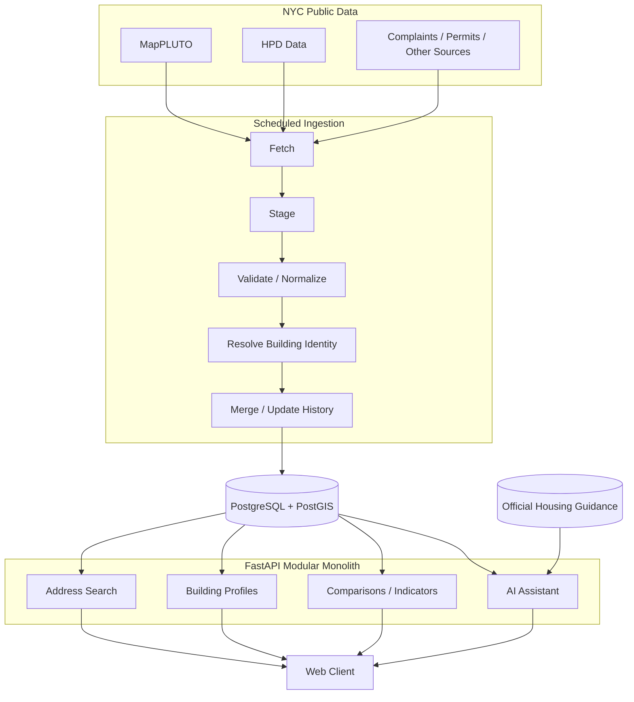
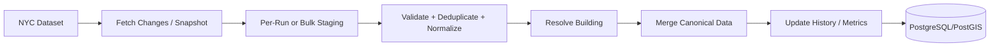

# NYC Housing Intelligence Platform

A web application that turns fragmented New York City housing data into clear, building-level information for renters.

NYC publishes extensive public records for housing-code violations, complaints, permits, property information, and related building history. Those records are useful, but they live across separate datasets with different schemas, identifiers, and address formats. This project combines that data into a single building profile that is easier to search, understand, and compare.

## Features

- Address-based building lookup
- Unified building profiles across multiple NYC datasets
- Current and historical housing violations
- Complaint history and trends
- Permit activity
- Recurring and persistent issue detection
- Building and neighborhood comparisons
- Explainable risk and quality indicators
- Natural-language questions about a building
- Retrieval of relevant official NYC housing guidance
- Source-aware results with visible data provenance

## Architecture

The application uses a **production-oriented modular monolith** backed by **PostgreSQL/PostGIS**. Periodic ingestion runs separately from request serving, and AI workloads are isolated so they do not interfere with normal building search and profile requests.

### Core design

- **PostgreSQL/PostGIS** is the authoritative store for structured building data.
- **Scheduled ingestion workers** keep public datasets current without competing with user-facing requests.
- **MapPLUTO and other large snapshots** are bulk-loaded into staging tables, validated, and merged into canonical tables.
- **Incremental HPD updates** use a lightweight per-run staging area before validation and merge.
- **Building identity resolution** connects records from different sources to a canonical building.
- **Deterministic domain logic** calculates trends, comparisons, and indicators used by both the web application and AI assistant.
- **AI execution is bounded and isolated**. Short, predictable requests may run synchronously; workloads whose latency or burstiness justifies it can run asynchronously through a queue and worker pool.

## Data Pipeline

NYC datasets update periodically rather than continuously, so the platform uses scheduled ingestion rather than a streaming architecture.

Each ingestion run is designed to preserve enough metadata to track source freshness, row counts, validation failures, and run status. This allows the application to distinguish between a true absence of reported events and missing or stale source data.

## Building Identity

Records from different NYC agencies do not always use the same address format or identifier. The platform resolves source records and user-entered addresses to a canonical building identity before they are used in profiles, comparisons, or historical analysis.

The resolver is designed to account for:

- agency-specific property identifiers
- inconsistent or incomplete addresses
- alternate entrances
- duplicate records
- missing identifiers
- historical property changes

This identity layer is central to joining violations, complaints, permits, property information, and historical metrics reliably.

## AI Assistant

The AI assistant provides natural-language analysis over the same application data shown elsewhere in the product.

Structured building facts remain deterministic and come from the application's domain layer. Official housing rules and tenant guidance are retrieved separately from trusted NYC documentation. The model is used to understand the user's question and synthesize evidence rather than act as an independent source of building facts.

AI workloads are subject to execution limits such as concurrency, timeouts, retries, and tool-call budgets so AI traffic cannot overwhelm the rest of the application.

## Technology Stack

| Area | Technology |
|---|---|
| Backend | Python, FastAPI |
| Primary database | PostgreSQL |
| Geospatial support | PostGIS |
| Data ingestion | Scheduled Python workers/jobs |
| Structured search and aggregation | PostgreSQL |
| Official-document retrieval | PostgreSQL full-text search initially |
| Semantic retrieval | pgvector if needed |
| AI integration | Model APIs with application-controlled orchestration |

Frontend, deployment, queue, scheduler, and model-provider choices are intentionally left open until implementation requirements make those decisions concrete.

## Data Sources

The platform is designed around publicly available NYC housing and property datasets, including:

- MapPLUTO property and lot data
- HPD housing-code violation data
- housing complaint data
- permit and building activity data
- official NYC housing guidance and tenant information

Additional sources may be incorporated as the product develops, provided they can be tied reliably to the platform's canonical building identity.

## Reliability and Data Quality

Public data is treated as externally controlled input rather than trusted application state. Ingestion validates and normalizes incoming records before they become canonical data.

The platform is designed to handle issues such as:

- duplicates and corrected records
- malformed or inconsistent values
- incomplete reporting periods
- failed or partial ingestion runs
- stale datasets
- missing building identifiers

Historical state and source provenance are preserved where necessary so renter-facing summaries can remain traceable to the underlying evidence.

## Project Status

This project is under active development. The current architecture is designed for a single production-oriented application with periodic public-data ingestion, modest user traffic, and isolated AI workloads.

The immediate focus is on reliable ingestion, building identity resolution, historical data modeling, building profiles, comparisons, and grounded AI-assisted analysis.

## Disclaimer

This project uses public NYC datasets and is intended as an informational tool. Public records may be incomplete, delayed, corrected, or subject to agency-specific reporting practices. Building summaries and indicators should be interpreted alongside their underlying source data rather than as definitive statements about a property or landlord.
